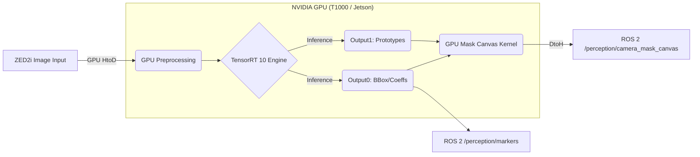

# ZED Camera-Based Cone Detection (YOLO26n-Seg)

Questo repository implementa un nodo di percezione ad altissime prestazioni che utilizza **YOLO26n-seg** con ottimizzazione **TensorRT 10** e **CUDA**. È progettato come sorgente visiva primaria per una pipeline di fusione LiDAR-Camera in ambienti Formula Student Driverless.

## 1. Architettura del Nodo (Pipeline GPU-Centric)

Il nodo è stato ottimizzato per minimizzare l'overhead della CPU e i trasferimenti di memoria, eseguendo l'intera pipeline di elaborazione direttamente sulla GPU.

### Schema a Blocchi della Pipeline


### Fasi di Elaborazione
1.  **Input**: Ricezione del frame `sensor_msgs/Image` (ZED2i).
2.  **GPU Preprocessing**: Un kernel CUDA custom esegue resize, conversione colore (BGR/RGBA -> RGB) e normalizzazione (0-1) in un unico passo, convertendo il formato da HWC a CHW.
3.  **TensorRT 10 Inference**: Esecuzione del modello YOLO26n-seg (End-to-End, senza NMS) per produrre bounding box, confidenze e coefficienti delle maschere.
4.  **GPU Mask Canvas (Post-processing)**: Un kernel CUDA "Winner-take-all" genera direttamente il `mask_canvas` (ID map) combinando linearmente i prototipi e i coefficienti, assegnando a ogni pixel l'ID della rilevazione a più alta confidenza.
5.  **Output**: Pubblicazione del `mask_canvas` (immagine `mono8`) e dei marker 3D per la pipeline di fusione.

## 2. Requisiti di Sistema

### Hardware
- **GPU**: NVIDIA (Architettura Turing o superiore raccomandata, es. T1000, Jetson Orin/Xavier).
- **VRAM**: Almeno 4GB (8GB raccomandati per risoluzioni 2K).

### Software
- **OS**: Ubuntu 22.04 / 24.04 con ROS 2 (Humble/Iron/Jazzy).
- **CUDA**: 12.x o 13.x.
- **TensorRT**: 10.0+.
- **OpenCV**: 4.5+ con supporto CUDA (opzionale, i kernel sono custom).

## 3. Configurazione e Build

### Prerequisiti
Assicurati che `nvcc` sia nel tuo PATH e che le librerie TensorRT siano installate in `/usr/lib/x86_64-linux-gnu` o aggiorna il `CMakeLists.txt` con il path corretto.

### Compilazione
```bash
cd ~/your_ws
colcon build --packages-select zed_fusion_perception --cmake-args -DCMAKE_BUILD_TYPE=Release
```

## 4. Input & Output del Nodo

| Topic | Tipo | Descrizione |
| :--- | :--- | :--- |
| **Input** | `sensor_msgs/Image` | Stream RGB rettificato dalla ZED2i. |
| **Input** | `sensor_msgs/CameraInfo` | Parametri intrinseci per la proiezione 3D. |
| **Output** | `/perception/camera_mask_canvas` | Immagine `mono8` dove ogni pixel è l'ID del cono (ID Map). |
| **Output** | `/perception/markers` | `MarkerArray` per visualizzazione 3D (Cilindri). |
| **Output** | `/perception/camera_cones` | `PoseArray` con le stime iniziali della posizione dei coni. |

## 5. Strategia di Fusione "Point-in-Mask"
Questo nodo abilita una fusione LiDAR-Camera geometricamente precisa:
- Il nodo **Fusion** proietta i punti del cluster LiDAR sul `mask_canvas`.
- Se un punto cade su un pixel con `valore > 0`, viene istantaneamente associato alla classe e al colore rilevati da YOLO per quel cono specifico.
- Questo metodo elimina gli errori di associazione tipici delle semplici Bounding Box.

## 6. Performance
Grazie all'offloading CUDA completo, il nodo raggiunge:
- **Latenza Pre/Post-processing**: < 1.5ms
- **Latenza Inferenza (T1000)**: ~5-7ms
- **Latenza Totale**: **< 10ms** (a 720p), permettendo pipeline real-time a 60+ FPS.
