# Camera Perception: YOLO26n-Seg with CUDA-Centric Architecture

This repository implements a high-performance visual perception node for Formula Student Driverless. The system acts as a **High-Performance Mask Provider**, providing precise real-time segmentation maps for LiDAR-Camera fusion algorithms.

## 1. GPU-Centric Architecture & Design Philosophy
The node's philosophy is **minimal CPU involvement**. The GPU handles the entire processing load, leaving the CPU free for planning and control tasks.

### 1.1 Pipeline Block Diagram

```mermaid
graph TD
    subgraph Node ["ZedPerceptionNode"]
        direction TB
        IMG[sensor_msgs/Image]
        
        subgraph Pipeline ["Optimized GPU Pipeline"]
            direction TB
            PRE[GPU Bilinear Preprocess]
            TRT{TensorRT 10 Engine}
            REF[HWC Reformatting Kernel]
            POST[Shared Memory Mask Kernel]
            
            PRE --> TRT
            TRT --> REF
            REF --> POST
        end

        subgraph Outputs ["Standard Outputs"]
            MC[camera_mask_canvas mono8]
        end
        
        IMG -->|HtoD| PRE
        POST -->|DtoH| MC
    end

    %% Styling
    style IMG fill:#04010C,stroke:#666,stroke-width:1px
    style Outputs fill:#04010C,stroke:#666,stroke-width:1px
    style Pipeline fill:#04010C,stroke:#005cc5,stroke-width:2px,stroke-dasharray: 5 5
    style PRE fill:#04010C,stroke:#005cc5,stroke-width:1px
    style TRT fill:#04010C,stroke:#005cc5,stroke-width:2px
    style REF fill:#04010C,stroke:#005cc5,stroke-width:1px
    style POST fill:#04010C,stroke:#005cc5,stroke-width:1px
```

## 2. CUDA Optimization Details
For an in-depth technical analysis of memory architecture choices, HWC layout, and cache management, please refer to the document: [CUDA Architecture Deep Dive](CUDA_ARCHITECTURE_DEEP_DIVE.md).

### 2.1 Pipeline Synchronization Path (Single-Sync)
The use of asynchronous computing requires careful management of synchronization points. Excessive synchronization negates the benefits of offloading. Our "Single-Sync Batch Pipeline" launches all GPU operations in sequence, allowing for **Compute-Transfer Overlap**: while the GPU computes, the PCIe bus downloads the data already ready.

```mermaid
sequenceDiagram
    participant CPU as Host (CPU)
    participant GPU as Device (GPU)
    
    rect rgb(4, 1, 12)
    Note over CPU, GPU: High-Speed Execution (Frame 1...N)
    CPU->>GPU: Launch Kernel Sequence (Preprocess -> TRT -> Reformat -> Mask)
    GPU-->>GPU: Parallel In-Hardware Execution
    GPU-->>CPU: Synchronize (Single barrier)
    end
```

### 2.2 Memory Reformatting (CHW to HWC)
YOLO26 prototypes are produced in CHW format. For each pixel, the GPU would have to read 32 channels distant from each other, saturating the controller with non-contiguous (strided) accesses.
**Solution**: A transposition kernel reorganizes the data into **HWC**. This ensures that the 32 channels are **physically contiguous** in VRAM, allowing for "coalesced" reads and maximizing cache throughput.

### 2.3 Shared Memory Tiling Post-processing
To avoid billions of redundant accesses to global VRAM, the post-processing kernel utilizes **Shared Memory** (programmable L1 cache). Threads load the coefficients of the 128 most relevant detections only once per block, slashing data access latency.

## 3. Experimental Results (NVIDIA T1000, 8GB)

| Metric | FP32 Input/Output | **FP16 Native (Optimized)** |
| :--- | :--- | :--- |
| **Average Latency** | 10.17 ms | **9.40 ms** |
| **P99 (99th Percentile)** | 13.25 ms | **12.67 ms** |
| **Effective Frequency** | 98 Hz | **107 Hz** |
| **Stability (Std Dev)** | 1.25 ms | **0.90 ms** |

## 4. Analysis and Benchmark
To reproduce the data:
1. Compile in Release: `colcon build --packages-select camera_perception --cmake-args -DCMAKE_BUILD_TYPE=Release`
2. Launch with export active: `ros2 launch camera_perception test_detection_launch.py export_stats:=true`
3. Analyze data: `python3 scripts/analyze_performance.py`

## 5. Advanced Integration with Fusion Node 
To optimize the LiDAR-Camera fusion pipeline, the following choices were implemented for the node's output:

### 5.1 Semantic Encoding (O(1) Class Query)
The mask canvas contains the **YOLO Class ID**. This allows the Fusion Node to know the projected cone color with a single memory access:
- `0`: Background
- `1`: Blue Cone
- `2`: Yellow Cone
- `3`: Orange Cone
- `4`: Big Orange Cone

### 5.2 Timestamp Preservation
The `mask_msg->header.stamp` field is guaranteed to be identical to the incoming raw image timestamp. This eliminates temporal synchronization issues (`MessageFilter` exact sync) in the fusion node.

### 5.3 Zero-Copy IPC (Component Registration)
The node has been migrated to the **ROS 2 Components** architecture. By registering `ZedPerceptionNode` as a `rclcpp_components::NodeFactory`, the system can exchange heavy segmentation canvases via **Shared Pointers (Shared Memory)** instead of serializing data on the ROS bus, significantly reducing inter-process latency overhead.
