```mermaid
graph TD
    subgraph Node ["ZedPerceptionNode"]
        direction TB
        IMG[sensor_msgs/Image]
        
        subgraph Pipeline ["Optimized GPU Pipeline"]
            direction TB
            PRE[GPU Bilinear Preprocess]
            TRT{TensorRT 10 Engine}
            REF[HWC Reformatting Kernel]
            POST[Shared Memory Mask Kernel]
            
            PRE --> TRT
            TRT --> REF
            REF --> POST
        end

        subgraph Outputs ["Standard Outputs"]
            MC[camera_mask_canvas mono8]
        end
        
        IMG -->|HtoD| PRE
        POST -->|DtoH| MC
    end

    %% Styling
    style IMG fill:#04010C,stroke:#666,stroke-width:1px
    style Outputs fill:#04010C,stroke:#666,stroke-width:1px
    style Pipeline fill:#04010C,stroke:#005cc5,stroke-width:2px,stroke-dasharray: 5 5
    style PRE fill:#04010C,stroke:#005cc5,stroke-width:1px
    style TRT fill:#04010C,stroke:#005cc5,stroke-width:2px
    style REF fill:#04010C,stroke:#005cc5,stroke-width:1px
    style POST fill:#04010C,stroke:#005cc5,stroke-width:1px
```

# Ultra-High Performance Perception: YOLO26n-Seg with CUDA-Centric Architecture

Questo repository implementa un nodo di percezione visuale ad altissime prestazioni per la Formula Student Driverless. Il sistema agisce come un **High-Performance Mask Provider**, fornendo mappe di segmentazione precise in tempo reale per algoritmi di fusione LiDAR-Camera.

## 1. Architettura GPU-Centric & Design Philosophy
La filosofia del nodo è il **minimale coinvolgimento della CPU**. La GPU gestisce l'intero carico di elaborazione, lasciando la CPU libera per i compiti di pianificazione e controllo.

### 1.1 Schema a Blocchi della Pipeline

## 2. Dettaglio delle Ottimizzazioni CUDA

### 2.1 Pipeline Synchronization Path (Single-Sync)
L'uso di calcolo asincrono richiede una gestione attenta dei punti di stop. Una sincronizzazione eccessiva annulla i benefici dell'offloading. La nostra "Single-Sync Batch Pipeline" lancia tutte le operazioni GPU in sequenza, permettendo il **Compute-Transfer Overlap**: mentre la GPU calcola, il bus PCIe scarica i dati già pronti.

```mermaid
sequenceDiagram
    participant CPU as Host (CPU)
    participant GPU as Device (GPU)
    
    rect rgb(4, 1, 12)
    Note over CPU, GPU: Phase 1: Capture & Instantiate (Frame 0)
    CPU->>GPU: Start Stream Capture
    CPU->>GPU: Record (Preprocess -> TRT -> Reformat -> Mask)
    CPU->>GPU: Instantiate Executable Graph
    end
    
    rect rgb(4, 1, 12)
    Note over CPU, GPU: Phase 2: High-Speed Execution (Frame 1...N)
    CPU->>GPU: cudaGraphLaunch(instance)
    GPU-->>GPU: Parallel In-Hardware Execution
    GPU-->>CPU: Synchronize (Single barrier)
    end
```

### 2.2 Memory Reformatting (CHW to HWC)
I prototipi di YOLO26 sono prodotti in formato CHW. Per ogni pixel, la GPU dovrebbe leggere 32 canali distanti tra loro, saturando il controller con accessi non contigui (strided).
**Soluzione**: Un kernel di trasposizione riorganizza i dati in **HWC**. Questo garantisce che i 32 canali siano **fisicamente contigui** in VRAM, permettendo letture "coalesced" e massimizzando il throughput della cache.

### 2.3 Shared Memory Tiling Post-processing
Per evitare miliardi di accessi ridondanti alla VRAM globale, il kernel di post-elaborazione utilizza la **Shared Memory** (L1 cache programmabile). I thread caricano i coefficienti delle 128 detection più rilevanti una sola volta per blocco, abbattendo la latenza di accesso ai dati.

## 3. Risultati Sperimentali (NVIDIA T1000, 8GB)

| Metrica | FP32 Input/Output | **FP16 Nativo (Ottimizzato)** |
| :--- | :--- | :--- |
| **Latenza Media** | 9.74 ms | **9.10 ms** |
| **P99 (99° Percentile)** | 13.27 ms | **13.64 ms** |
| **Frequenza Effettiva** | 104 Hz | **112 Hz** |
| **Stabilità (Std Dev)** | 1.25 ms | **1.12 ms (Graphs)** |

## 4. Analisi e Benchmark
Per riprodurre i dati per la tesi:
1. Compila in Release: `colcon build --packages-select zed_fusion_perception --cmake-args -DCMAKE_BUILD_TYPE=Release`
2. Lancia con export attivo: `ros2 launch zed_fusion_perception test_detection_launch.py export_stats:=true`
3. Analizza i dati: `python3 scripts/analyze_performance.py`
