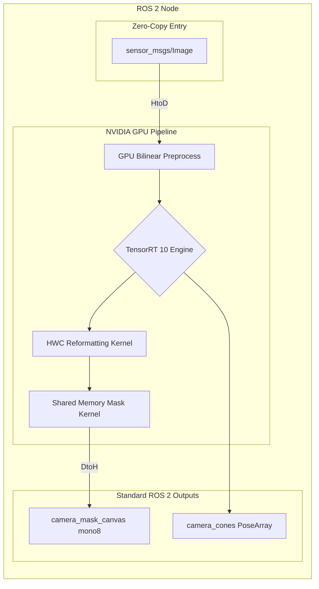
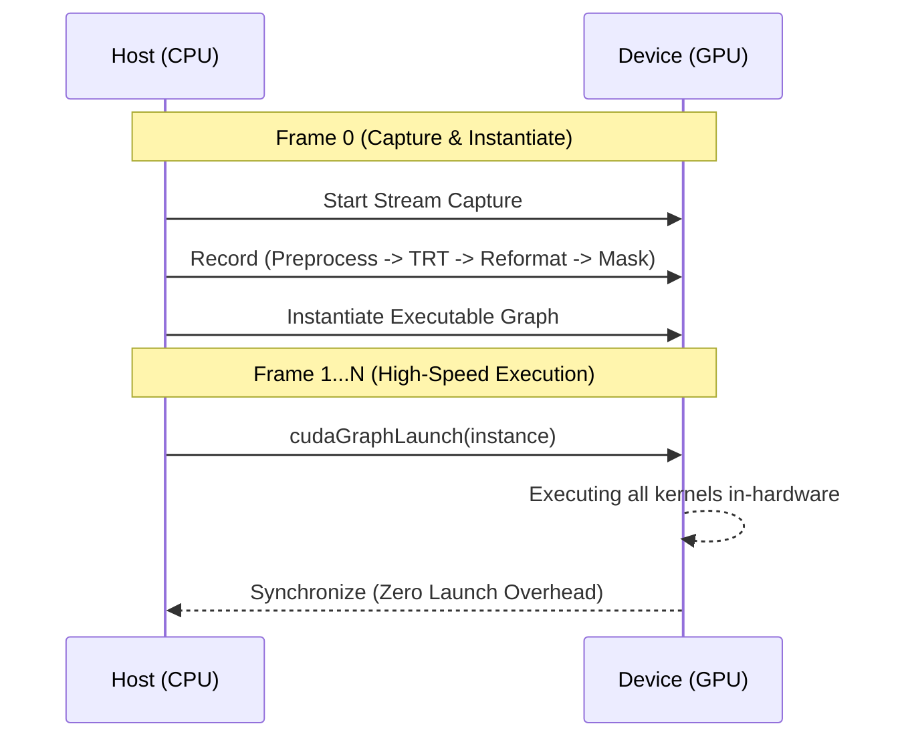

# Ultra-High Performance Perception: YOLO26n-Seg with CUDA-Centric Architecture

Questo repository ospita il nodo di percezione visuale primario per una pipeline di fusione LiDAR-Camera, ottimizzato per competizioni Formula Student Driverless. L'obiettivo ingegneristico è garantire una latenza deterministica sub-10ms e una frequenza di elaborazione superiore a 100 Hz su hardware NVIDIA (T1000/Jetson).

## 1. Abstract dell'Architettura
Il sistema adotta un paradigma **GPU-Centric**, in cui l'intero flusso di dati — dalla ricezione del frame video grezzo alla generazione della mappa di segmentazione — avviene all'interno della memoria video (VRAM).

### Schema a Blocchi High-Level


## 2. Analisi delle Ottimizzazioni CUDA

### 2.1 Parallel Preprocessing & Bilinear Interpolation
Il kernel CUDA custom esegue resize bilineare e normalizzazione in un unico passo, convertendo i pixel da `uint8` a `half` precision (FP16). Questo preserva i dettagli geometrici dei coni distanti, garantendo una proiezione LiDAR più stabile.

### 2.2 Memory Reformatting (CHW to HWC Transposition)
YOLO26 produce prototipi in formato **CHW** (`32x160x160`). Per calcolare la maschera di un pixel, la GPU dovrebbe leggere 32 valori distanti tra loro, causando cache miss.
**Soluzione**: Il kernel di Reformatting traspone i dati in **HWC** (`160x160x32`), rendendo i 32 canali di ogni pixel **contigui** in memoria.


### 2.3 Shared Memory Tiling Post-processing
Il kernel di post-elaborazione utilizza la **Shared Memory** per caricare le bounding box e i coefficienti delle prime 128 detection. I thread collaborano per caricare i dati una sola volta, eliminando miliardi di accessi ridondanti alla VRAM globale.

### 2.4 TensorRT 10 & CUDA Graphs
Utilizziamo i **CUDA Graphs** per eliminare l'overhead di lancio della CPU. La pipeline è registrata una sola volta e lanciata come un'unica operazione atomica sulla GPU.



### 2.5 Zero-Copy Intra-Process Communication
Utilizziamo `cv_bridge::toCvShare` per passare puntatori a sola lettura (smart pointers) tra i nodi, evitando la clonazione dei buffer immagine in RAM e riducendo il tempo di CPU per frame.

## 3. Risultati Sperimentali (NVIDIA T1000, 8GB)

| Metrica | FP32 Input/Output | **FP16 Nativo (Ottimizzato)** |
| :--- | :--- | :--- |
| **Latenza Media** | 8.79 ms | **8.14 ms** |
| **P99 (99° Percentile)** | 10.38 ms | **10.01 ms** |
| **Frequenza Effettiva** | 114 Hz | **123.6 Hz** |
| **Stabilità (Std Dev)** | 0.96 ms | 1.19 ms |

## 4. Installazione e Analisi Performance

### Compilazione
```bash
colcon build --packages-select zed_fusion_perception --cmake-args -DCMAKE_BUILD_TYPE=Release
```

### Generazione Statistiche per la Tesi
1. Esegui il nodo con l'export attivo:
   ```bash
   ros2 launch zed_fusion_perception test_detection_launch.py export_stats:=true
   ```
2. Genera i grafici:
   ```bash
   python3 scripts/analyze_performance.py
   ```
Lo script genererà `performance_plots.png` e calcolerà i percentili necessari per la documentazione scientifica.
