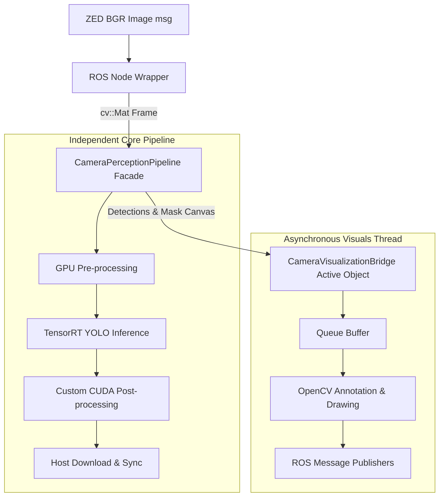

# Camera Pipeline Architecture and Component Workflow

This document provides a detailed overview of the Camera-based Cone Detection perception pipeline, outlining data flow, stages, and the decoupled design patterns.

---

## 1. System Architecture Diagram

The camera perception node processes high-resolution BGR images sequentially. It is structured to decouple ROS 2 topic handling from high-performance TensorRT/CUDA inference and CPU-bound OpenCV visualization rendering.

---

## 2. Stage-by-Stage Processing Flow

1.  **Image Ingest & Conversion**:
    The main ROS node wrapper [zed_perception_node.cpp](file:///Users/m2pro/Lidar_Camera_fusion_ws/src/Camera_based_Cone_Detection/src/zed_perception_node.cpp) receives camera frames and converts them to `cv::Mat` objects using zero-copy cv_bridge sharing.
2.  **GPU Pre-processing**:
    The frame is uploaded to GPU memory where a custom CUDA preprocessing kernel (`launch_preprocess`) resizes, normalizes, and converts the layout of the image to match the TensorRT engine input shape.
3.  **TensorRT Inference**:
    Executes YOLOv8-based segmentation on an optimized CUDA execution stream, producing bounding boxes, confidence scores, and raw mask prototypes.
4.  **HWC Transposition & Mask Post-processing**:
    Custom CUDA post-processing kernels reorganize the raw CHW prototypes to HWC layout to resolve L1/L2 cache misses, compute the dot product between mask prototypes and detection coefficients, and construct the final binary mask canvas directly on the GPU.
5.  **Asynchronous Visualization**:
    The host coordinates are downloaded and synchronised, then immediately enqueued into the [CameraVisualizationBridge](file:///Users/m2pro/Lidar_Camera_fusion_ws/src/Camera_based_Cone_Detection/src/camera_visualization_bridge.cpp). The main thread returns immediately.
6.  **Annotations & Publishing**:
    The background worker thread pops the data, draws circles and bounding boxes on the debug frame, and publishes the topics (Mono8 mask canvas, Detection2DArray bounding boxes, debug images) to ROS 2.

---

## 3. Decoupled C++ Components

To ensure high maintainability, the code is structured into clean, decoupled components:

*   **`CameraPipelineConfig`** ([camera_pipeline_config.hpp](file:///Users/m2pro/Lidar_Camera_fusion_ws/src/Camera_based_Cone_Detection/include/camera_pipeline_config.hpp)):
    A structured parameters object containing engine file paths, NMS thresholds, and feature flags. Exposes no ROS dependencies.
*   **`CameraPerceptionPipeline`** ([camera_perception_pipeline.hpp](file:///Users/m2pro/Lidar_Camera_fusion_ws/src/Camera_based_Cone_Detection/include/camera_perception_pipeline.hpp)):
    The core facade containing the inference engine, managing GPU buffer lifecycles, executing inference, and calling CUDA kernels. Exposes no ROS dependencies.
*   **`CameraVisualizationBridge`** ([camera_visualization_bridge.hpp](file:///Users/m2pro/Lidar_Camera_fusion_ws/src/Camera_based_Cone_Detection/include/camera_visualization_bridge.hpp)):
    An Active Object wrapper that runs its own execution thread, isolating OpenCV drawing calls and ROS publisher serialization from the main pipeline.
*   **`ZedPerceptionNode`** ([zed_perception_node.hpp](file:///Users/m2pro/Lidar_Camera_fusion_ws/src/Camera_based_Cone_Detection/include/zed_perception_node.hpp)):
    The ROS 2 Wrapper component. Instantiates parameters, configures the config struct, binds subscriptions, and manages the execution flow.
